# Eden — Evolution Plan

> **Status**: Proposed
> **Date**: 2026-03-12
> **Author**: Adam / Claude
> **Scope**: Evolve PM Expert Panel into Eden requirements platform — new agents,
>   React SPA, NestJS backend, managed DB, event-driven automation
> **Supersedes**: `dashboard-app.md` (story map concept retained, data model replaced)
> **Depends on**: `chat-attachment-aware-agents.md` (implemented),
>   Eve Horizon gap closure (org-aware auth, workflow job graphs, server-side `with_apis`)
> **Reference impl**: `incept5/sentinel-mgr` (SSO + org isolation pattern)
> **PRD**: `docs/prd/EdenPRD.md` (Steve's product vision — architecture here, not there)
>
> **Platform features used**:
>   - Eve Auth SDK (`@eve-horizon/auth`, `@eve-horizon/auth-react`) — org-aware: `orgs`, `activeOrg`, `switchOrg()`
>   - Gateway providers (Slack webhook ingestion as primary chat ingress)
>   - Job API (list, show, result, stream, attachments)
>   - Eve ingest + object storage (presigned uploads, `ingest://` hydration, optional app buckets)
>   - Managed DB (Postgres 16 with RLS)
>   - Event spine (`system.doc.ingest` + `app.*` follow-on events)
>   - Workflow job graphs (multi-step `depends_on` compiled into job DAGs)
>   - Server-side `with_apis` (app API attachment for workflow steps + direct jobs)
>   - SSE job streams for real-time progress
>   - Coordination threads and inbox
>   - AgentPack system (agents.yaml, teams.yaml, chat.yaml, workflows.yaml)

---

## The Insight

The PM expert panel already does the hardest thing — it turns documents into
structured expert feedback. But that feedback evaporates into Slack threads.

Eden turns the expert panel into an **engine** that feeds a **living story map**.
Documents go in. AI agents extract requirements, propose structured changes,
detect alignment issues. Humans review and approve. The map evolves continuously.

The key shift: **from review-and-forget to extract-and-accumulate.**

---

## Design Principles

1. **The map is the product.** The story map is not a view of something else.
   It *is* the canonical representation of what we're building, for whom, and
   in what order.

2. **AI proposes, humans decide.** Every AI modification goes through a
   changeset — a reviewable batch of proposed changes with reasoning. No
   silent writes to the map. Full audit trail.

3. **Eve does the orchestration.** File processing, agent dispatch, event
   routing, and workflow coordination all happen on Eve's primitives. The
   NestJS backend owns the domain model and changeset system. The SPA owns
   the visual experience. Nobody does someone else's job.

4. **Agent-native from day one.** Agents and humans use the same API. The
   story map API is the single source of truth — agents create changesets,
   humans review them, both can edit directly.

5. **Incremental evolution.** The existing 8-agent expert panel stays intact.
   New agents and workflows layer on top. Nothing breaks.

---

## What Users See

> **UX reference**: `docs/prd/story_map.html` — Ade's interactive prototype for
> the Chivo 2.0 story map. Eden's React SPA should follow the layout,
> interactions, and visual patterns established there, adapted for the Eden
> domain model and agent-driven workflows.

### Screen Layout

```
┌─────────────────────────────────────────────────────────────────────────────┐
│ HEADER ─ gradient dark                                                      │
│  Eden — [Project Name]             34 Tasks  22 Qs  12 Steps  [■■■■░] 45%  │
│  [Expand All] [Questions Only] [Cross-Cutting Qs] [Print] [Chat] [⚙]      │
│  Role filters:  (PM) (ENG) (UX) (ADMIN)                                    │
├─────────────────────────────────────────────────────────────────────────────┤
│ PERSONA TABS ─ sticky                                                       │
│  OVERVIEW (34)  │  ● PM (18)  │  ● ENG (12)  │  ● UX (8)  │  ● ADMIN (6) │
├─────────────────────────────────────────────────────────────────────────────┤
│ LEGEND ─ sticky                                                             │
│  ● PM  ● ENG  ● UX  ● ADMIN  │  ─ ─ Handoff  │  ⚑ Question  ✓ Done      │
├─────────────────────────────────────────────────────────────────────────────┤
│                                                                             │
│ MAP GRID ─ CSS Grid, horizontally scrollable                                │
│                                                                             │
│ ┌─────────────┬──────────────┬──────────────┬──────────────┐  ← Activity   │
│ │ ACT-1       │  ACT-1       │  ACT-1       │  ACT-1       │    header     │
│ │ Fund Wallet │  Fund Wallet │  Fund Wallet │  Fund Wallet │    (dark bg)  │
│ ├─────────────┼──────────────┼──────────────┼──────────────┤  ← Step       │
│ │ STP-1.1     │  STP-1.2     │  STP-1.3     │  STP-1.4     │    header     │
│ │ Deposit at  │  Deposit at  │  Direct Bank │  Bank        │    (accent)   │
│ │ Store       │  ATM         │  Transfer    │  Transfer    │               │
│ ├─────────────┼──────────────┼──────────────┼──────────────┤  ← Task       │
│ │ ┌─────────┐ │ ┌─────────┐  │ ┌─────────┐  │ ┌─────────┐  │    cells     │
│ │ │TSK-1.1.1│ │ │TSK-1.2.1│  │ │TSK-1.3.1│  │ │TSK-1.4.1│  │    (cards)   │
│ │ │ PM  ALL │ │ │ ENG ALL │  │ │ PM  DSK │  │ │ ENG ALL │  │              │
│ │ │Tienda   │ │ │ATM Cash │  │ │Direct   │  │ │Bank     │  │              │
│ │ │Cash-In  │ │ │Deposit  │  │ │Deposit  │  │ │Transfer │  │              │
│ │ │ ⚑ 2 Qs │ │ │         │  │ │         │  │ │ ⚑ 1 Q  │  │              │
│ │ │ ▼       │ │ │         │  │ │         │  │ │         │  │              │
│ │ └─────────┘ │ └─────────┘  │ └─────────┘  │ └─────────┘  │              │
│ │ ┌ ─ ─ ─ ─┐ │              │              │              │  ← Handoff   │
│ │ │TSK-1.1.2│ │              │              │              │    card      │
│ │ │ADMIN→PM │ │              │              │              │    (dashed)  │
│ │ │Scanning │ │              │              │              │              │
│ │ └ ─ ─ ─ ─┘ │              │              │              │              │
│ ├─────────────┼──────────────┼──────────────┼──────────────┤              │
│ │ ACT-2 ...   │              │              │              │              │
│ └─────────────┴──────────────┴──────────────┴──────────────┘              │
│                                                                             │
└─────────────────────────────────────────────────────────────────────────────┘

SLIDE-IN PANELS (right side, overlaying map):

┌─ Chat Panel ──────────────┐   ┌─ Cross-Cutting Qs ────────┐
│ 💬 Chat Assistant    [×]  │   │ Cross-Cutting Questions [×]│
│                           │   │                            │
│ 🔵 You:                  │   │ ┌──────────────────────┐   │
│ "Add admin approval step" │   │ │ Q-19 [HIGH]          │   │
│                           │   │ │ KYC requirements for │   │
│ ⚪ Eden:                  │   │ │ wallet registration?  │   │
│ "Proposed changeset #14:  │   │ │ Refs: ACT-1 ACT-2    │   │
│  + Step 'Admin Approval'  │   │ └──────────────────────┘   │
│  + Task 'Review app'      │   │ ┌──────────────────────┐   │
│  [Review Changes]"        │   │ │ Q-20 [HIGH]          │   │
│                           │   │ │ AML monitoring        │   │
│ ┌───────────────────┐     │   │ │ thresholds?           │   │
│ │ Message...    [Send]│    │   │ └──────────────────────┘   │
│ └───────────────────┘     │   └────────────────────────────┘
└───────────────────────────┘
```

### Journey Map Structure

The story map uses a **journey-persona grid** — a 2D CSS Grid organised by
user journey (activities as rows) with steps as columns and tasks as cards.
This is *not* Jeff Patton's user story mapping model (where activities flow
left-to-right across a single backbone and the vertical axis is priority).
Eden's layout is persona-centric: persona tabs switch the entire map view,
and the vertical axis is activities (journey phases), not priority.

The grid layout from Ade's prototype uses three visual bands per activity:

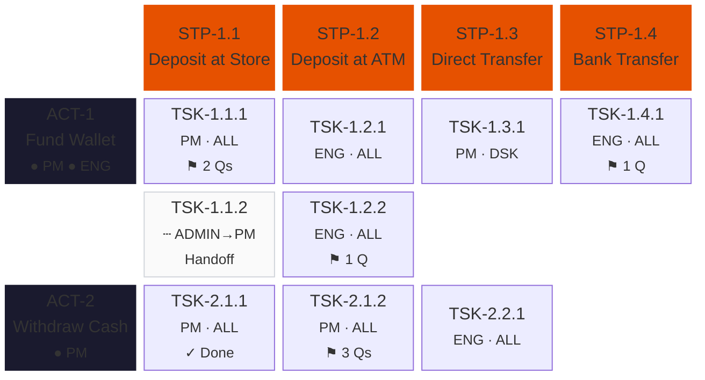

> **Activity rows** = dark header band (`#1a1a2e`) with activity ID, name, persona
>   pills (colored by persona), and an amber question-count badge at the right.
>   Full description appears as a tooltip on hover.
> **Step cells** = accent-colored header (`#e65100`) with step ID and title.
>   Full description appears as a tooltip. Left border colored by dominant persona
>   when viewing a specific persona tab.
> **Task cards** = expandable cards with persona badge, device badge, status,
>   question count. Click to expand → user story, acceptance criteria, questions.
> **Handoff cards** = dashed border (`2px dashed #d1d5db`), dimmed background
>   (`#fafafa`, 85% opacity), showing persona-to-persona handoff arrow badge.

### Key UX Patterns (from Ade's Prototype)

#### Card Anatomy

Each task card is expandable (click to toggle). Collapsed shows badges + title.
Expanded reveals the full detail:

| Element | Description |
|---------|-------------|
| **Badge row** | Task ID (e.g. `TSK-1.1.1`), persona pill(s), device badge (desktop/mobile/all) |
| **Title** | Task name with expand chevron |
| **User story** | Accent-bordered block: "As a [persona], I want..." |
| **Acceptance criteria** | Checklist with AC IDs (Given/When/Then format) |
| **Questions section** | Amber pills with priority badges (high/medium/low), clickable to open modal |
| **AI indicators** | Purple left border = AI-modified, Green left border = AI-added |

#### Persona Tabs

The tab bar below the header shows one tab per persona plus a "Platform
Overview" (all personas). Each tab shows a persona-colored dot and task count.
Switching tabs filters the map to show only tasks assigned to that persona
(other cards dim to 15% opacity with `pointer-events: none`).

#### Role Filter Buttons

In the header, pill-shaped buttons for each persona. When active, non-matching
cards dim. This is an additional filter on top of the persona tab — useful for
the Overview tab to highlight one persona without switching views.

#### Cross-Cutting Questions Panel

A slide-in right panel (separate from the chat panel) showing questions that
span multiple activities. These are red-themed (vs amber for task-level
questions) and reference multiple activities/tasks. Each card shows: Q ID,
priority badge, question text, clickable reference tags that highlight the
referenced tasks on the map.

#### Question Modal

Clicking a question (in a card or the cross-cutting panel) opens a centered
modal with: question text, metadata (priority, category, references),
response textarea with autosave, and an "Evolve Map" button that triggers
the map-chat agent to propose changes based on the answer.

#### Review Panel (Changeset Review)

A centered modal (680px wide) for reviewing AI-proposed changesets:

| Element | Description |
|---------|-------------|
| **Summary** | 1-2 sentence description of all proposed changes |
| **Bulk actions** | Accept All / Reject All buttons |
| **Change cards** | Per-item cards with type icon (blue=modify, green=add, amber=resolve) |
| **Per-item buttons** | Accept/reject per individual change |
| **Diff view** | Expandable before/after with colored additions/deletions |
| **Footer** | Discard / Apply Accepted Changes buttons |

#### Chat Panel

A slide-in right panel (560px, separate from cross-cutting panel):
- User messages in accent color (right-aligned)
- AI messages in gray (left-aligned), can include "Review Changes" button
- Typing indicator with animated dots
- Textarea with send button

#### Stats Bar (Header)

The header displays aggregate stats in large bold numbers with small uppercase
labels underneath. From Ade's prototype the stat pills are:

| Stat | Label | Notes |
|------|-------|-------|
| Activities count | ACTIVITIES | |
| Steps count | STEPS | |
| Tasks count | TASKS | |
| Acceptance criteria count | ACS | Total across all tasks |
| Questions count | QUESTIONS | Task-level only |
| Cross-cutting count | CROSS-CUT | Cross-cutting questions only |
| Answer progress | X/Y + bar | Green fill bar (80px × 6px) + "Answered" label |

### ID Format Convention

Following Ade's prototype, entities use hierarchical IDs:

| Entity | Format | Example |
|--------|--------|---------|
| Activity | `ACT-{n}` | `ACT-1` |
| Step | `STP-{act}.{n}` | `STP-1.2` |
| Task | `TSK-{act}.{step}.{n}` | `TSK-1.2.1` |
| User story | `US-{act}.{step}.{n}` | `US-1.2.1` |
| Acceptance criterion | `AC-{act}.{step}.{n}{letter}` | `AC-1.2.1a` |
| Question | `Q-{n}` | `Q-14` |

These human-readable IDs are stored alongside UUIDs. The API uses UUIDs;
the UI displays the human-readable IDs. Agents reference entities by
human-readable ID in changesets (the backend resolves to UUIDs).

### Visual Design Tokens (from Ade's Prototype)

Eden's React SPA should carry Ade's look and feel as closely as possible.
The following CSS custom properties and patterns define the visual identity:

#### Color System

```css
/* Base palette */
--bg: #f0f2f5;              /* Page background (light gray) */
--surface: #ffffff;          /* Card/panel background */
--border: #e2e5e9;           /* Default borders */
--text: #1a1a2e;             /* Primary text (near-black) */
--text-2: #6b7280;           /* Secondary text (gray) */

/* Accent (deep orange — brand identity) */
--accent: #e65100;           /* Step headers, active states, card-id badges */
--accent-light: #fff3e0;     /* Card-id badge background */
--accent-dark: #bf360c;      /* Hover states */

/* Structural colors */
--activity-bg: #1a1a2e;      /* Activity row headers (dark navy) */
--step-bg: #e65100;           /* Step row headers (deep orange) */

/* Question theming */
--q-bg: #fffbeb;             /* Task-level question background (amber) */
--q-border: #f59e0b;         /* Task-level question border */
--q-text: #92400e;           /* Task-level question text */
--cq-bg: #fef2f2;            /* Cross-cutting question background (red) */
--cq-border: #ef4444;        /* Cross-cutting question border */
--cq-text: #991b1b;          /* Cross-cutting question text */

/* Status */
--green: #10b981;            /* Progress bar fill, success states */
```

#### Persona Colors

Each persona gets a color used for tabs, badges, role pills, and filter buttons:

```css
/* Persona color scheme — map to project personas dynamically */
--md-color: #6366f1;   --md-bg: #eef2ff;    /* Indigo */
--est-color: #0891b2;  --est-bg: #ecfeff;   /* Cyan */
--pm-color: #059669;   --pm-bg: #ecfdf5;    /* Emerald */
--ps-color: #d97706;   --ps-bg: #fffbeb;    /* Amber */
```

Eden should store persona colors in the DB (`personas.color`) and generate
these tokens dynamically. The prototype hardcodes 4 personas; Eden supports N.

#### Typography

- **Font**: Inter (weight 300–900), fallback to system sans-serif
- **Header title**: 24px, weight 800, letter-spacing -0.5px
- **Stats numbers**: 22px, weight 800
- **Stats labels**: 9px, weight 600, uppercase, letter-spacing 0.6px
- **Card title**: 12px, weight 600
- **Card ID badge**: 8px, weight 700, deep orange on light orange bg
- **Role badge**: 7px, weight 800, white on persona color
- **Device badge**: 7px, weight 700
- **User story label**: 8px, weight 800, uppercase, deep orange
- **User story text**: 10px, italic
- **AC text**: 10px
- **AC ID**: 8px, weight 700, deep orange

#### Spacing & Layout

- **Column width**: 320px (`--col-w`)
- **Border radius**: 10px (`--radius`)
- **Map padding**: 24px 32px (bottom padding 120px for scroll space)
- **Header padding**: 24px 32px
- **Card padding**: 10px 12px (top area), 0 12px 12px (body when expanded)
- **Shadows**: `0 1px 3px rgba(0,0,0,.08)` (card), `0 4px 12px rgba(0,0,0,.1)` (hover/open), `0 12px 36px rgba(0,0,0,.12)` (modals/panels)

#### Key Visual Patterns

| Pattern | Implementation |
|---------|---------------|
| **Sticky header** | `position: sticky; top: 0; z-index: 100` — gradient dark background |
| **Sticky tabs** | `position: sticky; top: 76px; z-index: 99` — white bg, bottom border |
| **Sticky legend** | `position: sticky; top: 118px; z-index: 98` — white bg, thin border |
| **Card hover** | Box shadow + orange border on hover |
| **Card expanded** | Body revealed via `display: block`, chevron rotates 180deg |
| **Role dimming** | Non-matching cards get `opacity: 0.15; transform: scale(0.97); pointer-events: none` |
| **Handoff card** | `border: 2px dashed #d1d5db; background: #fafafa; opacity: 0.85` |
| **User story block** | `border-left: 3px solid var(--accent)` — light gray bg, rounded right corners |
| **AC checkmarks** | Green checkmark icon, AC-ID in orange, Given/When/Then text |
| **Question pills** | Amber background, priority badge (high/medium/low), clickable |
| **Cross-cutting cards** | Red border/background, grouped by category with section headers |
| **Header gradient** | `linear-gradient(135deg, #1a1a2e, #16213e, #0f3460)` |
| **Answer progress** | Thin bar (80px × 6px, rounded), green fill, "X/Y Answered" label |
| **Activity question badge** | Amber pill in activity header showing task-level question count |
| **Active button** | `.on` class → accent bg + border (`var(--accent)`) |
| **Device badges** | desktop=gray, mobile=amber, all=indigo — tiny pill |

#### Slide-In Panels

Both the chat panel and cross-cutting questions panel slide in from the right:

| Panel | Width | Z-index | Background | Close |
|-------|-------|---------|------------|-------|
| **Chat** | 560px | 200 | White | × button |
| **Cross-cutting Qs** | 480px | 200 | White | × button |
| **Question modal** | 680px (centered) | 300 | White + backdrop blur | Close button |
| **Changeset review** | 680px (centered) | 300 | White + backdrop blur | Discard / Apply |

### Sidebar Views

| View | What |
|------|------|
| **Map** (default) | Journey-persona grid — activities (rows) × steps (columns) × tasks (cards) |
| **Sources** | Ingested documents with processing status and source traceability |
| **Reviews** | Expert panel reviews with synthesis + individual expert opinions |
| **Q&A** | All questions across the map — open, answered, resolved |
| **Changes** | Changeset history — pending review, accepted, rejected |
| **Releases** | Release planning — group tasks, set dates, track status |

### Header Controls

| Control | Purpose |
|---------|---------|
| **Project** | Switch between projects within the org |
| **Release** | Filter map to show only tasks in a release (or "All") |
| **Persona tabs** | Switch between persona views or platform overview |
| **Role filter pills** | Highlight a persona's tasks within any view |
| **Org** | Dropdown populated from `orgs` via `useEveAuth()`. Selecting an org calls `switchOrg(orgId)` — session updates, RLS context changes, projects list refreshes. |
| **Expand All** | Toggle: expand all task cards to show user stories, ACs, and questions |
| **Questions Only** | Toggle: expand only cards that have open questions (others collapse) |
| **Cross-Cutting Qs** | Toggle: open the cross-cutting questions slide-in panel |
| **Chat** | Toggle: open the chat assistant slide-in panel |
| **Print** | Print the current map view (uses print stylesheet) |
| **Export JSON** | Download the full project data as structured JSON |
| **Export MD** | Download the story map as a Markdown document |
| **Settings** | Project settings (personas, integrations, API key) |

---

## Authentication (Eve SSO)

Two-mode login: Eve SSO (default) and CLI token paste. The auth SDK now
exposes org membership and active-org switching as first-class primitives:

```typescript
// From @eve-horizon/auth-react
const { user, orgs, activeOrg, switchOrg, loginWithSso, logout } = useEveAuth();

// orgs: EveAuthOrg[] — all orgs the user belongs to
// activeOrg: EveAuthOrg | null — currently selected org (id, slug, name, role)
// switchOrg(orgId: string) — changes active org through platform session contract
```

**Key details:**
- Frontend: `EveAuthProvider` + `useEveAuth` from `@eve-horizon/auth-react`
- Backend: `eveUserAuth()` middleware, bridge to `req.user` with org context
- Org switcher in the header renders `orgs` list, calls `switchOrg()` on selection
- Database: RLS with `app.org_id` session variable per transaction (set from `activeOrg.id`)
- Agent auth: Service principal tokens for agent → API calls

---

## Architecture

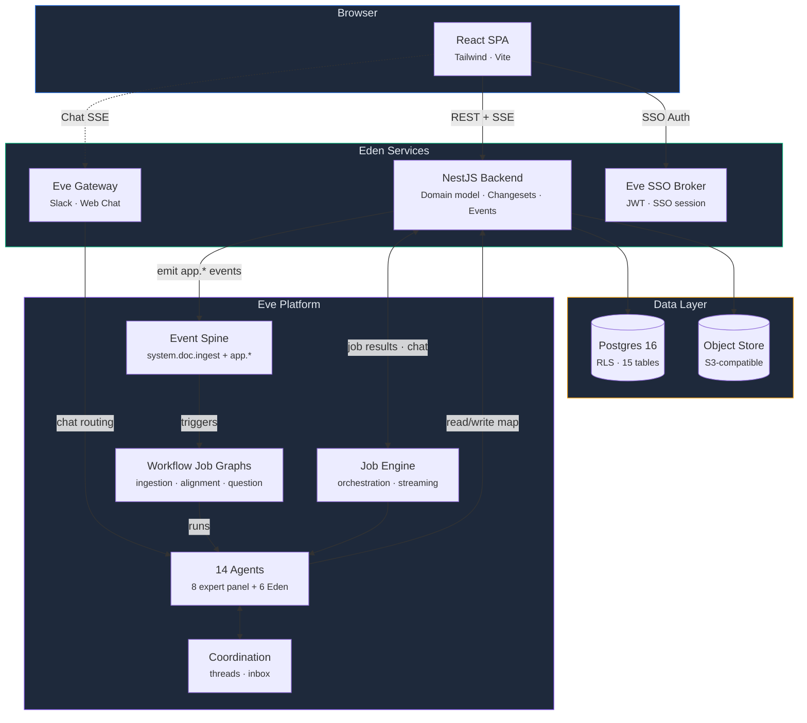

### Components

| Component | What | Deployed as |
|---|---|---|
| **SPA** | React 19 + Tailwind + Vite | Eve service (`role: component`, public ingress) |
| **API** | NestJS backend (domain model, changesets, events) | Eve service (`role: worker`, public ingress) |
| **DB** | Managed Postgres 16 + RLS | Eve managed service (`role: managed_db`) |
| **Object Store** | S3-compatible bucket for uploads | Eve object store (via manifest) |
| **Agent Pack** | 14 agents, 1 team, workflows | Synced via `eve agents sync` |

### Why NestJS + React (not just Eve agents)

Eve agents are the intelligence layer. They process files, extract requirements,
detect alignment issues, and propose changes. But they don't own:

1. **The story map domain model** — activities, steps, tasks, personas, releases
2. **The changeset system** — propose → review → accept/reject workflow
3. **Org isolation** — RLS-enforced multi-tenancy
4. **Aggregation** — join sources → reviews → tasks → questions
5. **The visual experience** — CSS Grid story map, drag-and-drop, persona overlays

The NestJS backend is the domain authority. Eve is the orchestration engine.
The SPA is the human interface. Agents talk to the same API humans do.

---

## Event-Driven Automation

File ingestion uses Eve's ingest primitive. The backend creates an Eve ingest
record, the browser uploads directly to the presigned URL, and confirm emits
`system.doc.ingest`. Eden-specific follow-on automation uses `app.*` events.

Workflows now expand into real job DAGs — the `ingestion-pipeline` creates
three step jobs (ingest → extract → synthesize) with `depends_on` edges,
rather than collapsing into a single entry agent. Each step job inherits
`with_apis` for Eden API access from the workflow declaration.

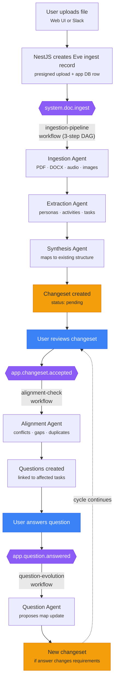

### Event Catalog

| Event | Emitted by | Triggers | Payload |
|-------|-----------|----------|---------|
| `system.doc.ingest` | Eve ingest confirm | `ingestion-pipeline` | ingest_id, file_name, mime_type, size_bytes, storage_key, source metadata |
| `app.changeset.accepted` | NestJS (changeset review) | `alignment-check` | project_id, changeset_id |
| `app.question.answered` | NestJS (Q&A) | `question-evolution` | project_id, question_id, task_id |
| `app.review.completed` | NestJS (job sync) | — (future) | project_id, review_id |

---

## Agent Architecture

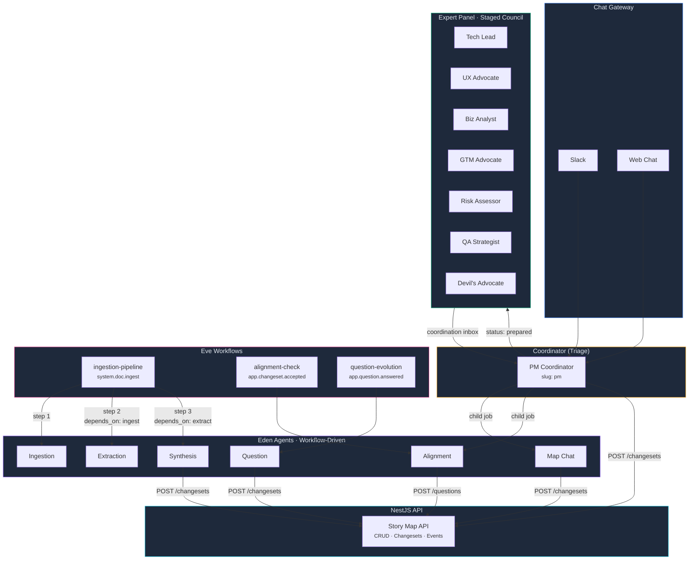

### Existing Agents (Unchanged)

The 8-agent expert panel stays exactly as-is. The coordinator triages Slack
messages, dispatches the expert panel for document reviews, and handles
simple questions solo. This is proven, deployed, working.

| Agent | Slug | Role |
|---|---|---|
| PM Coordinator | `pm` | Triages, processes files, dispatches panel, synthesizes |
| Tech Lead | `tech-lead` | Technical feasibility, architecture |
| UX Advocate | `ux-advocate` | UX, accessibility, i18n |
| Business Analyst | `biz-analyst` | Process flows, success criteria |
| GTM Advocate | `gtm-advocate` | Revenue, competitive positioning |
| Risk Assessor | `risk-assessor` | Timeline, dependency, regulatory risk |
| QA Strategist | `qa-strategist` | Testing strategy, edge cases |
| Devil's Advocate | `devils-advocate` | Challenges assumptions |

### New Agents (Eden Capabilities)

Six new internal agents that operate on the story map via the NestJS API.
None are gateway-routable — they're invoked by workflows or by the
coordinator as child jobs.

| Agent | Slug | Profile | Invoked by | What it does |
|---|---|---|---|---|
| **Ingestion** | `ingestion` | expert | `ingestion-pipeline` step 1 | Receives hydrated `ingest://` file input, performs media/text extraction. Output passes to extraction step. |
| **Extraction** | `extraction` | expert | `ingestion-pipeline` step 2 (`depends_on: [ingest]`) | Identifies personas, activities, steps, tasks, acceptance criteria, and questions from extracted content. Outputs structured JSON. |
| **Synthesis** | `synthesis` | coordinator | `ingestion-pipeline` step 3 (`depends_on: [extract]`) | Reads extracted requirements + current map state (via `with_apis` → Eden API). Proposes a changeset. |
| **Alignment** | `alignment` | coordinator | `alignment-check` workflow | Scans the full story map for conflicts, gaps, duplicates, and unresolved assumptions. Creates questions linked to affected tasks. |
| **Map Chat** | `map-chat` | coordinator | Coordinator (child job) | Conversational map editing. Reads the map, reasons about the user's request, creates a changeset. |
| **Question** | `question-agent` | expert | `question-evolution` workflow | When a question is answered, checks if the answer changes requirements. Proposes a map changeset if needed. |

### Coordinator Evolution

The coordinator's triage logic expands to handle Eden-specific intents.
Everything else stays the same.

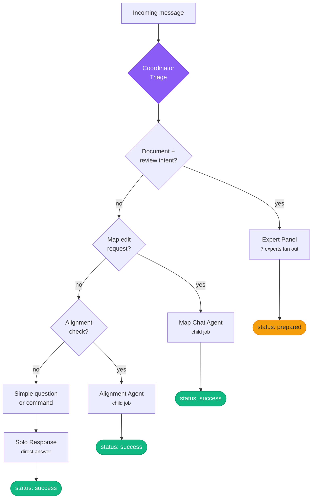

**New triage categories** (added to existing logic):

| Signal | Action | eve.status |
|--------|--------|------------|
| Map edit request ("add step", "move task", "create activity") | Create child job for `map-chat` agent | `success` (after child completes) |
| "check alignment" / "find conflicts" / "scan for gaps" | Create child job for `alignment` agent | `success` |
| Existing: document + review intent | Full expert panel (unchanged) | `prepared` |
| Existing: simple question | Solo response (unchanged) | `success` |

**Post-synthesis enhancement**: After the expert panel synthesizes, the
coordinator now also calls the NestJS API to create a changeset from the
actionable items in expert feedback. The changeset link is included in
the Slack response alongside the executive summary.

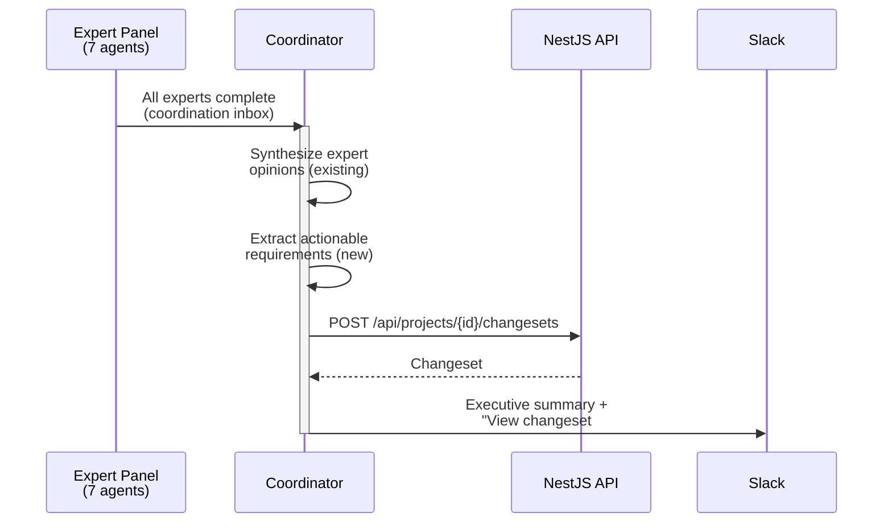

### Agent Config (eve/agents.yaml additions)

```yaml
# New agents (appended to existing agents.yaml)

ingestion:
  slug: ingestion
  skill: ingestion
  harness_profile: expert
  gateway:
    policy: none
  policies:
    permission_policy: auto_edit
    git:
      commit: never
      push: never

extraction:
  slug: extraction
  skill: extraction
  harness_profile: expert
  gateway:
    policy: none
  policies:
    permission_policy: auto_edit
    git:
      commit: never
      push: never

synthesis:
  slug: synthesis
  skill: synthesis
  harness_profile: coordinator
  context:
    memory:
      agent: shared
      categories: [decisions, conventions, context]
      max_items: 20
    threads:
      coordination: true
      max_messages: 30
  gateway:
    policy: none
  policies:
    permission_policy: auto_edit
    git:
      commit: never
      push: never

alignment:
  slug: alignment
  skill: alignment
  harness_profile: coordinator
  context:
    memory:
      agent: shared
      categories: [decisions, conventions]
      max_items: 20
  gateway:
    policy: none
  policies:
    permission_policy: auto_edit
    git:
      commit: never
      push: never

map-chat:
  slug: map-chat
  skill: map-chat
  harness_profile: coordinator
  context:
    memory:
      agent: shared
      categories: [decisions, conventions, context]
      max_items: 20
  gateway:
    policy: none
  policies:
    permission_policy: auto_edit
    git:
      commit: never
      push: never

question-agent:
  slug: question-agent
  skill: question
  harness_profile: expert
  gateway:
    policy: none
  policies:
    permission_policy: auto_edit
    git:
      commit: never
      push: never
```

The YAML above uses the current schema: `gateway.policy` and `policies.*`.
`context` is deliberate for Eden agents that benefit from shared decisions,
conventions, and coordination thread carry-over materialized into `.eve/context/`.

### Workflow Config (eve/workflows.yaml additions)

Workflows now compile into job DAGs via the platform's workflow-to-job-graph
expansion. Multi-step `depends_on` creates real job dependencies — no
app-side orchestration glue needed. `with_apis` declares app API access
at the workflow level (inherited by all steps) or per step (override).

```yaml
# New workflows (appended to existing workflows.yaml)

ingestion-pipeline:
  trigger:
    system:
      event: doc.ingest
  with_apis:
    - service: api
      description: Eden Story Map API for reading map state and creating changesets
  steps:
    - name: ingest
      agent:
        name: ingestion
    - name: extract
      depends_on: [ingest]
      agent:
        name: extraction
    - name: synthesize
      depends_on: [extract]
      agent:
        name: synthesis
  timeout: 900

alignment-check:
  trigger:
    app:
      event: changeset.accepted
  with_apis:
    - service: api
      description: Eden Story Map API for reading map state and creating questions
  steps:
    - name: align
      agent:
        name: alignment
  timeout: 300

question-evolution:
  trigger:
    app:
      event: question.answered
  with_apis:
    - service: api
      description: Eden Story Map API for reading questions/tasks and creating changesets
  steps:
    - name: evolve
      agent:
        name: question-agent
  timeout: 300
```

At invocation time, Eve creates a root workflow job plus a child job for each
step. `depends_on` edges become job dependencies — `extract` waits for
`ingest` to complete, `synthesize` waits for `extract`. Context and structured
outputs carry forward through step edges. The full graph is visible in Eve's
job tree views.

---

## The Changeset System

Central to Eden's safety model. All AI modifications — from ingestion,
map chat, alignment, question processing, or expert synthesis — go through
the same propose → review → accept/reject flow.

### Changeset Lifecycle

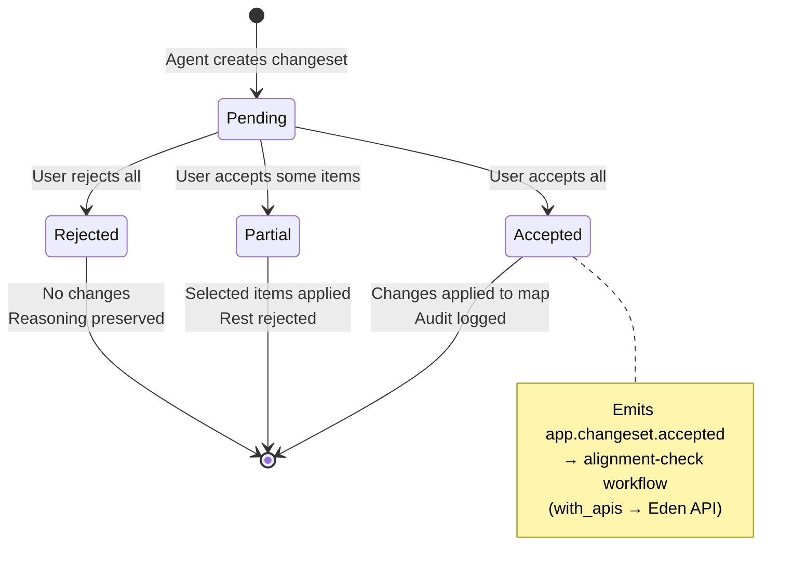

### Changeset UI

Each changeset shows:
- **Title**: "3 new tasks from Q1 Roadmap review"
- **Source**: Which agent/workflow created it (ingestion, map-chat, alignment, expert-panel)
- **Reasoning**: Why the agent proposed these changes
- **Items**: Each proposed change with before/after state
  - Create activity "Mobile Onboarding"
  - Create step "App Download" under "Mobile Onboarding"
  - Create task "Deep link from invite email" (persona: new-user, priority: high)
  - Update task "SSO Login" — add acceptance criterion
  - Create question on task "Cart Checkout" — "What about guest checkout?"
- **Actions**: Accept All / Reject All / per-item accept/reject

### Agent Access Pattern

All agents create changesets through the same API endpoint:

```bash
POST /api/projects/{project_id}/changesets
Authorization: Bearer ${EVE_TOKEN}
Content-Type: application/json

{
  "title": "Requirements from Q1 Roadmap.pdf",
  "reasoning": "Extracted 8 user stories from the uploaded roadmap...",
  "source": "ingestion",
  "source_job_id": "pm-abc12345",
  "items": [
    {
      "entity_type": "activity",
      "operation": "create",
      "after_state": {
        "name": "Mobile Onboarding",
        "description": "First-time mobile app experience",
        "sort_order": 3
      }
    },
    {
      "entity_type": "task",
      "operation": "create",
      "after_state": {
        "title": "Deep link from invite email",
        "user_story": "As a new user, I want to tap a link in my invite email and land directly in the app so I don't have to search for it.",
        "acceptance_criteria": "- Deep link opens app store if not installed\n- Deep link opens app to onboarding if installed\n- Works on iOS and Android",
        "priority": "high",
        "step_placement": {
          "activity_name": "Mobile Onboarding",
          "step_name": "App Download",
          "persona_code": "new-user",
          "role": "owner"
        }
      }
    },
    {
      "entity_type": "question",
      "operation": "create",
      "after_state": {
        "task_ref": "Deep link from invite email",
        "question": "What tracking parameters should the deep link include?",
        "context": "Need to attribute installs to invite campaigns",
        "source": "agent:extraction"
      }
    }
  ]
}
```

The backend resolves references (activity names, step names, persona codes)
to IDs, validates the changeset, and stores it as pending. When accepted,
it applies each item as a database operation within a single transaction.

---

## Data Model (Managed DB)

All tables include `org_id` with RLS policies for org isolation.

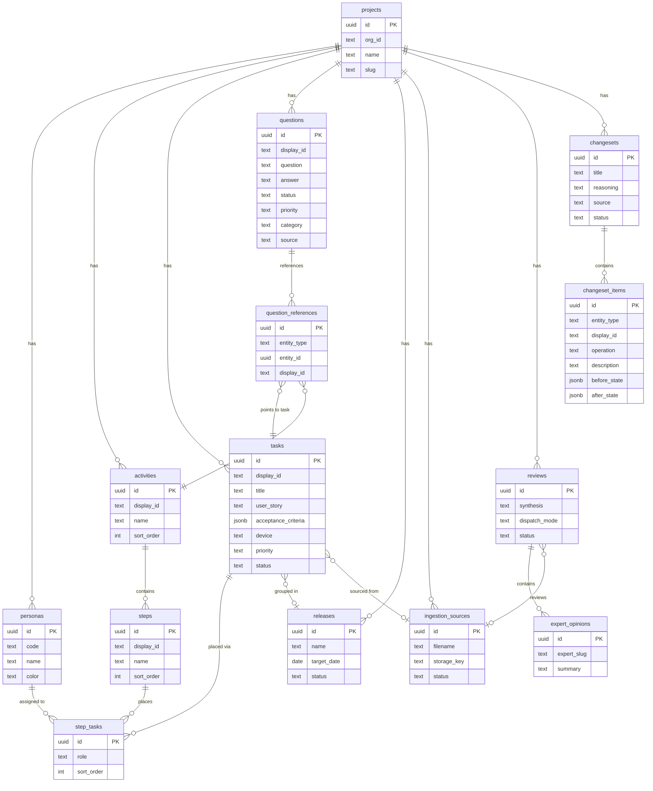

### Core Map Entities

```sql
-- Projects (workspace containers, org-scoped)
CREATE TABLE projects (
    id              UUID PRIMARY KEY DEFAULT gen_random_uuid(),
    org_id          TEXT NOT NULL,
    name            TEXT NOT NULL,
    slug            TEXT NOT NULL,
    description     TEXT,
    slack_channel_id TEXT,
    slack_team_id   TEXT,
    eve_project_id  TEXT,
    created_at      TIMESTAMPTZ DEFAULT now(),
    updated_at      TIMESTAMPTZ DEFAULT now(),
    UNIQUE (org_id, slug)
);

-- Personas (user archetypes for a project)
CREATE TABLE personas (
    id              UUID PRIMARY KEY DEFAULT gen_random_uuid(),
    org_id          TEXT NOT NULL,
    project_id      UUID NOT NULL REFERENCES projects(id) ON DELETE CASCADE,
    code            TEXT NOT NULL,           -- "admin", "buyer", "support"
    name            TEXT NOT NULL,           -- "System Administrator"
    description     TEXT,
    color           TEXT,                    -- Hex color for UI
    device          TEXT,                    -- "desktop" | "mobile" | "tablet"
    sort_order      INT DEFAULT 0,
    created_at      TIMESTAMPTZ DEFAULT now(),
    updated_at      TIMESTAMPTZ DEFAULT now(),
    UNIQUE (project_id, code)
);

-- Activities (top-level journey rows on the map)
CREATE TABLE activities (
    id              UUID PRIMARY KEY DEFAULT gen_random_uuid(),
    org_id          TEXT NOT NULL,
    project_id      UUID NOT NULL REFERENCES projects(id) ON DELETE CASCADE,
    display_id      TEXT NOT NULL,              -- Human-readable: "ACT-1", "ACT-2"
    name            TEXT NOT NULL,
    description     TEXT,
    sort_order      INT DEFAULT 0,
    created_at      TIMESTAMPTZ DEFAULT now(),
    updated_at      TIMESTAMPTZ DEFAULT now(),
    UNIQUE (project_id, display_id)
);

-- Steps (columns within an activity)
CREATE TABLE steps (
    id              UUID PRIMARY KEY DEFAULT gen_random_uuid(),
    org_id          TEXT NOT NULL,
    activity_id     UUID NOT NULL REFERENCES activities(id) ON DELETE CASCADE,
    display_id      TEXT NOT NULL,              -- Human-readable: "STP-1.1", "STP-1.2"
    name            TEXT NOT NULL,
    description     TEXT,
    sort_order      INT DEFAULT 0,
    created_at      TIMESTAMPTZ DEFAULT now(),
    updated_at      TIMESTAMPTZ DEFAULT now(),
    UNIQUE (activity_id, display_id)
);

-- Tasks (atomic requirements unit — the card on the map)
CREATE TABLE tasks (
    id                  UUID PRIMARY KEY DEFAULT gen_random_uuid(),
    org_id              TEXT NOT NULL,
    project_id          UUID NOT NULL REFERENCES projects(id) ON DELETE CASCADE,
    display_id          TEXT NOT NULL,        -- Human-readable: "TSK-1.2.1"
    title               TEXT NOT NULL,
    description         TEXT,
    user_story          TEXT,                -- "As a [persona], I want..."
    user_story_id       TEXT,                -- Human-readable: "US-1.2.1" (matches display_id)
    acceptance_criteria JSONB DEFAULT '[]',  -- [{id: "AC-1.2.1a", text: "Given...When...Then..."}]
    device              TEXT DEFAULT 'all',   -- "desktop" | "mobile" | "tablet" | "all"
    priority            TEXT DEFAULT 'medium',   -- low | medium | high | critical
    status              TEXT DEFAULT 'draft',    -- draft | refined | approved | in_progress | done
    release_id          UUID REFERENCES releases(id) ON DELETE SET NULL,
    source_id           UUID REFERENCES ingestion_sources(id) ON DELETE SET NULL,
    source_excerpt      TEXT,                -- Specific text from source that spawned this
    created_by          TEXT,                -- 'agent:<slug>' | user email
    metadata            JSONB DEFAULT '{}',
    created_at          TIMESTAMPTZ DEFAULT now(),
    updated_at          TIMESTAMPTZ DEFAULT now(),
    UNIQUE (project_id, display_id)
);

-- Step-Tasks (task placement on the map grid)
CREATE TABLE step_tasks (
    id              UUID PRIMARY KEY DEFAULT gen_random_uuid(),
    org_id          TEXT NOT NULL,
    step_id         UUID NOT NULL REFERENCES steps(id) ON DELETE CASCADE,
    task_id         UUID NOT NULL REFERENCES tasks(id) ON DELETE CASCADE,
    persona_id      UUID REFERENCES personas(id) ON DELETE SET NULL,
    role            TEXT DEFAULT 'owner',    -- owner | handoff | shared
    sort_order      INT DEFAULT 0,
    created_at      TIMESTAMPTZ DEFAULT now(),
    UNIQUE (step_id, task_id, persona_id)
);
```

### Questions & Releases

```sql
-- Questions (task-level or cross-cutting)
CREATE TABLE questions (
    id              UUID PRIMARY KEY DEFAULT gen_random_uuid(),
    org_id          TEXT NOT NULL,
    project_id      UUID NOT NULL REFERENCES projects(id) ON DELETE CASCADE,
    display_id      TEXT NOT NULL,           -- Human-readable: "Q-14" or "CQ-1" (cross-cutting)
    question        TEXT NOT NULL,
    context         TEXT,                    -- Why this question matters
    answer          TEXT,
    status          TEXT DEFAULT 'open',     -- open | answered | resolved | dismissed
    priority        TEXT DEFAULT 'medium',   -- low | medium | high
    category        TEXT,                    -- implementation | business_rules | integration |
                                             -- product_decision | compliance | scope | architecture |
                                             -- operations | UX
    source          TEXT NOT NULL,           -- 'agent:<slug>' | 'user' | 'alignment'
    resolved_by     TEXT,
    created_at      TIMESTAMPTZ DEFAULT now(),
    answered_at     TIMESTAMPTZ,
    resolved_at     TIMESTAMPTZ,
    UNIQUE (project_id, display_id)
);

-- Question references (links questions to tasks, steps, or activities)
-- Task-level questions reference 1 task; cross-cutting questions reference
-- multiple activities. This replaces the old task_id FK on questions.
CREATE TABLE question_references (
    id              UUID PRIMARY KEY DEFAULT gen_random_uuid(),
    org_id          TEXT NOT NULL,
    question_id     UUID NOT NULL REFERENCES questions(id) ON DELETE CASCADE,
    entity_type     TEXT NOT NULL,           -- 'task' | 'step' | 'activity'
    entity_id       UUID NOT NULL,           -- References tasks.id, steps.id, or activities.id
    display_id      TEXT,                    -- Cached human-readable ID (e.g. "TSK-1.1.2", "ACT-1")
    created_at      TIMESTAMPTZ DEFAULT now()
);

-- Releases (task groupings for delivery)
CREATE TABLE releases (
    id              UUID PRIMARY KEY DEFAULT gen_random_uuid(),
    org_id          TEXT NOT NULL,
    project_id      UUID NOT NULL REFERENCES projects(id) ON DELETE CASCADE,
    name            TEXT NOT NULL,
    description     TEXT,
    target_date     DATE,
    status          TEXT DEFAULT 'planning', -- planning | in_progress | released
    sort_order      INT DEFAULT 0,
    created_at      TIMESTAMPTZ DEFAULT now(),
    updated_at      TIMESTAMPTZ DEFAULT now()
);
```

### Ingestion & Reviews

```sql
-- Ingestion sources (uploaded files with processing state)
CREATE TABLE ingestion_sources (
    id              UUID PRIMARY KEY DEFAULT gen_random_uuid(),
    org_id          TEXT NOT NULL,
    project_id      UUID NOT NULL REFERENCES projects(id) ON DELETE CASCADE,
    eve_ingest_id   TEXT UNIQUE,              -- Mirrors Eve ingest record ID
    filename        TEXT NOT NULL,
    content_type    TEXT,
    size_bytes      BIGINT,
    storage_key     TEXT NOT NULL,            -- Object store key
    source_channel  TEXT NOT NULL,            -- 'web' | 'slack' | 'cli'
    raw_text        TEXT,                     -- Extracted text content
    status          TEXT DEFAULT 'uploaded',  -- uploaded | processing | extracted | synthesized | failed
    eve_job_id      TEXT,
    uploaded_by     TEXT,
    created_at      TIMESTAMPTZ DEFAULT now(),
    processed_at    TIMESTAMPTZ
);

-- Expert reviews (denormalized from Eve job results)
CREATE TABLE reviews (
    id              UUID PRIMARY KEY DEFAULT gen_random_uuid(),
    org_id          TEXT NOT NULL,
    project_id      UUID REFERENCES projects(id),
    source_id       UUID REFERENCES ingestion_sources(id),
    eve_job_id      TEXT NOT NULL,
    dispatch_mode   TEXT DEFAULT 'council',
    request_summary TEXT,
    synthesis       TEXT,
    expert_count    INT,
    status          TEXT DEFAULT 'in_progress',  -- in_progress | complete
    created_at      TIMESTAMPTZ DEFAULT now(),
    completed_at    TIMESTAMPTZ
);

-- Expert opinions
CREATE TABLE expert_opinions (
    id              UUID PRIMARY KEY DEFAULT gen_random_uuid(),
    org_id          TEXT NOT NULL,
    review_id       UUID NOT NULL REFERENCES reviews(id) ON DELETE CASCADE,
    expert_slug     TEXT NOT NULL,
    summary         TEXT NOT NULL,
    eve_job_id      TEXT,
    completed_at    TIMESTAMPTZ DEFAULT now()
);
```

### Changesets & Audit

```sql
-- Changesets (AI-proposed modifications to the map)
CREATE TABLE changesets (
    id              UUID PRIMARY KEY DEFAULT gen_random_uuid(),
    org_id          TEXT NOT NULL,
    project_id      UUID NOT NULL REFERENCES projects(id) ON DELETE CASCADE,
    title           TEXT NOT NULL,
    description     TEXT,
    reasoning       TEXT,
    source          TEXT NOT NULL,            -- 'ingestion' | 'map-chat' | 'alignment' | 'question' | 'expert-panel'
    source_job_id   TEXT,
    status          TEXT DEFAULT 'pending',   -- pending | accepted | rejected | partial
    item_count      INT DEFAULT 0,
    created_by      TEXT,                    -- 'agent:<slug>' | user email
    reviewed_by     TEXT,
    created_at      TIMESTAMPTZ DEFAULT now(),
    reviewed_at     TIMESTAMPTZ
);

-- Changeset items (individual operations)
-- Maps to Ade's UI change types: modify_task, add_task, modify_question,
-- add_question, resolve_question, modify_user_story. The UI renders type
-- icons: blue=modify, green=add, amber=resolve.
CREATE TABLE changeset_items (
    id              UUID PRIMARY KEY DEFAULT gen_random_uuid(),
    org_id          TEXT NOT NULL,
    changeset_id    UUID NOT NULL REFERENCES changesets(id) ON DELETE CASCADE,
    entity_type     TEXT NOT NULL,            -- 'activity' | 'step' | 'task' | 'step_task' | 'persona' | 'question' | 'release' | 'user_story'
    entity_id       UUID,                    -- NULL for creates
    display_id      TEXT,                    -- Human-readable target ID (e.g. "TSK-1.2.1")
    operation       TEXT NOT NULL,            -- 'create' | 'update' | 'delete' | 'move' | 'resolve'
    description     TEXT,                    -- What changed and why (shown in review card)
    before_state    JSONB,                   -- NULL for creates
    after_state     JSONB,                   -- NULL for deletes
    status          TEXT DEFAULT 'pending',   -- pending | accepted | rejected
    sort_order      INT DEFAULT 0
);

-- Audit log (full change history)
CREATE TABLE audit_log (
    id              UUID PRIMARY KEY DEFAULT gen_random_uuid(),
    org_id          TEXT NOT NULL,
    project_id      UUID NOT NULL,
    entity_type     TEXT NOT NULL,
    entity_id       UUID NOT NULL,
    action          TEXT NOT NULL,            -- 'create' | 'update' | 'delete'
    changeset_id    UUID REFERENCES changesets(id),
    changes         JSONB,
    actor           TEXT NOT NULL,            -- 'agent:<slug>' | user email | 'system'
    created_at      TIMESTAMPTZ DEFAULT now()
);

-- RLS policies (applied to all tables)
ALTER TABLE projects ENABLE ROW LEVEL SECURITY;
ALTER TABLE personas ENABLE ROW LEVEL SECURITY;
ALTER TABLE activities ENABLE ROW LEVEL SECURITY;
ALTER TABLE steps ENABLE ROW LEVEL SECURITY;
ALTER TABLE tasks ENABLE ROW LEVEL SECURITY;
ALTER TABLE step_tasks ENABLE ROW LEVEL SECURITY;
ALTER TABLE questions ENABLE ROW LEVEL SECURITY;
ALTER TABLE question_references ENABLE ROW LEVEL SECURITY;
ALTER TABLE releases ENABLE ROW LEVEL SECURITY;
ALTER TABLE ingestion_sources ENABLE ROW LEVEL SECURITY;
ALTER TABLE reviews ENABLE ROW LEVEL SECURITY;
ALTER TABLE expert_opinions ENABLE ROW LEVEL SECURITY;
ALTER TABLE changesets ENABLE ROW LEVEL SECURITY;
ALTER TABLE changeset_items ENABLE ROW LEVEL SECURITY;
ALTER TABLE audit_log ENABLE ROW LEVEL SECURITY;

-- Same pattern for all: org_id = current_setting('app.org_id', true)
CREATE POLICY org_isolation ON projects
  USING (org_id = current_setting('app.org_id', true));
-- ... applied to every table
```

---

## API Design (NestJS Backend)

All endpoints require Eve SSO auth. Org context from JWT, applied via RLS.

### Projects

```
GET    /api/projects                          List projects (with counts)
POST   /api/projects                          Create project
GET    /api/projects/:id                      Project detail
PATCH  /api/projects/:id                      Update project
DELETE /api/projects/:id                      Delete project
```

### Personas

```
GET    /api/projects/:id/personas             List personas
POST   /api/projects/:id/personas             Create persona
PATCH  /api/personas/:id                      Update persona
DELETE /api/personas/:id                      Delete persona
```

### Activities & Steps

```
GET    /api/projects/:id/activities           List activities with steps
POST   /api/projects/:id/activities           Create activity
PATCH  /api/activities/:id                    Update activity
DELETE /api/activities/:id                    Delete activity (cascades steps)
POST   /api/projects/:id/activities/reorder   Bulk reorder

GET    /api/activities/:id/steps              List steps
POST   /api/activities/:id/steps              Create step
PATCH  /api/steps/:id                         Update step
DELETE /api/steps/:id                         Delete step
POST   /api/activities/:id/steps/reorder      Bulk reorder
```

### Tasks

```
GET    /api/projects/:id/tasks                List tasks (filterable by step, persona, status, release)
POST   /api/projects/:id/tasks                Create task (with step placement)
GET    /api/tasks/:id                         Task detail (with questions, source, placements)
PATCH  /api/tasks/:id                         Update task
DELETE /api/tasks/:id                         Delete task
POST   /api/tasks/:id/place                   Place task on step (create step_task)
DELETE /api/step-tasks/:id                    Remove task from step
POST   /api/projects/:id/tasks/reorder        Bulk reorder within step
```

### Story Map (Composite)

```
GET    /api/projects/:id/map                  Full map: activities → steps → tasks → questions
                                               Supports ?persona=<code> for filtered view
                                               Supports ?release=<id> for release slice
                                               Response includes display_ids, device badges,
                                               question counts per task, persona colors,
                                               and role (owner/handoff/shared) per step_task.
                                               Stats: activities, steps, tasks, ACs,
                                               questions, cross-cutting count,
                                               answer progress (answered / total).
```

### Questions

```
GET    /api/projects/:id/questions            List questions (filterable)
                                               ?status=open|answered|resolved|dismissed
                                               ?category=implementation|compliance|...
                                               ?priority=high|medium|low
                                               ?type=task|cross-cutting (task_id-based vs activity refs)
                                               ?reference=TSK-1.2.1 (by display_id)
POST   /api/projects/:id/questions            Create question (with references[])
PATCH  /api/questions/:id                     Update (answer, resolve, dismiss)
POST   /api/questions/:id/evolve              Answer + trigger question-evolution workflow
GET    /api/projects/:id/questions/stats       Question counts by status, category, priority
GET    /api/projects/:id/questions/cross-cutting  Cross-cutting questions only (refs activities)
```

### Releases

```
GET    /api/projects/:id/releases             List releases
POST   /api/projects/:id/releases             Create release
PATCH  /api/releases/:id                      Update release
DELETE /api/releases/:id                      Delete release (tasks become unassigned)
POST   /api/releases/:id/tasks                Assign tasks to release
DELETE /api/releases/:id/tasks/:taskId        Remove task from release
```

### Ingestion Sources

```
GET    /api/projects/:id/sources              List ingested documents (paginated)
POST   /api/projects/:id/sources              Create source + Eve ingest upload session
POST   /api/sources/:id/confirm               Confirm upload and trigger processing
GET    /api/sources/:id                       Source detail (with review status)
GET    /api/sources/:id/download              Download original file (presigned URL)
```

### Reviews

```
GET    /api/projects/:id/reviews              List reviews (paginated)
GET    /api/reviews/:id                       Review detail (with expert opinions)
GET    /api/reviews/:id/stream                SSE stream of review progress
```

### Changesets

```
GET    /api/projects/:id/changesets           List changesets (filterable by status, source)
POST   /api/projects/:id/changesets           Create changeset (agent or user)
GET    /api/changesets/:id                    Changeset detail (with items, before/after)
POST   /api/changesets/:id/accept             Accept all items → apply to map
POST   /api/changesets/:id/reject             Reject all items
POST   /api/changesets/:id/review             Partial: accept/reject individual items
```

### Chat (proxied to Eve)

```
GET    /api/projects/:id/chat/threads         List chat threads
GET    /api/chat/threads/:id/messages         Thread messages
POST   /api/chat/threads/:id/messages         Send message (routes to coordinator)
GET    /api/chat/threads/:id/stream           SSE stream
```

The Eden backend should wrap Eve's existing chat route + thread primitives,
not invent a parallel chat store:
- Route inbound app chat through Eve `POST /projects/{eve_project_id}/chat/route`
- Reuse Eve thread IDs / thread messages for continuity across Slack and web

### Eve Events Integration

```
No Eden-specific public events endpoint. Backend services call Eve
`POST /projects/{eve_project_id}/events` directly with service credentials.
```

---

## Ingestion Pipeline (Detail)

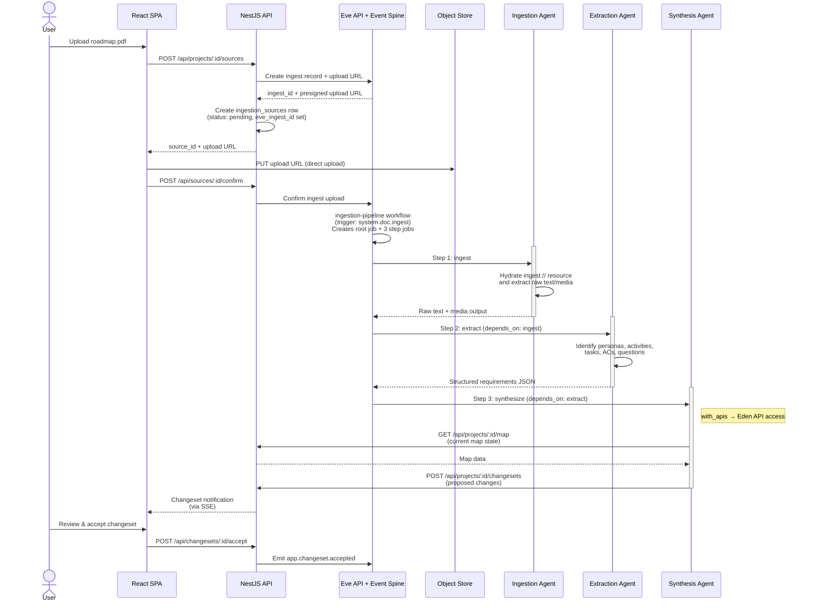

### Multi-Modal Processing

The ingestion agent handles file type detection and content extraction:

| File Type | Processing | Output |
|-----------|-----------|--------|
| PDF | `pdftotext` or PyMuPDF (via tool) | Raw text with page markers |
| DOCX | Read natively (or `mammoth` for complex docs) | Structured text |
| PPTX | Slide-by-slide text extraction | Slide-numbered text |
| Images | Claude Vision (describe content, extract text) | Description + OCR text |
| Audio | `whisper-cli` (already available in agent runtime) | Timestamped transcript |
| Video | `ffmpeg` audio extraction → Whisper | Timestamped transcript |
| Markdown/Text | Direct read | Raw text |
| CSV/JSON/YAML | Direct read with structure annotation | Annotated content |

### Extraction Output Schema

The extraction agent produces structured JSON that the synthesis agent consumes:

```json
{
  "personas": [
    { "code": "buyer", "name": "Online Buyer", "description": "...", "device": "all" }
  ],
  "activities": [
    {
      "name": "Purchasing",
      "steps": [
        {
          "name": "Browse Products",
          "tasks": [
            {
              "title": "Search by category",
              "user_story": "As a buyer, I want to browse by category...",
              "acceptance_criteria": [
                { "text": "Given the buyer is on the homepage, When they click a category, Then products filter" }
              ],
              "persona": "buyer",
              "device": "all",
              "priority": "high"
            }
          ]
        }
      ]
    }
  ],
  "questions": [
    {
      "question": "Is guest checkout supported?",
      "context": "Document mentions login but not guest path",
      "references": ["Checkout flow"],
      "priority": "high",
      "category": "product_decision"
    }
  ],
  "cross_cutting_questions": [
    {
      "question": "What payment gateways are supported across all flows?",
      "references": ["Purchasing", "Refunds"],
      "priority": "high",
      "category": "integration"
    }
  ],
  "source_mappings": [
    { "task": "Search by category", "excerpt": "Users should be able to..." }
  ]
}
```

### Synthesis Logic

The synthesis agent reads the extracted requirements AND the current map
(via `GET /api/projects/:id/map`), then decides:

1. **Match**: Does an existing activity/step/task cover this? → Update changeset item
2. **New**: No match → Create changeset item
3. **Conflict**: Contradicts existing content → Create question on the conflicting task
4. **Duplicate**: Very similar to existing → Skip (or create question to confirm)

The synthesis agent creates a single changeset containing all proposed
changes, with reasoning for each item.

---

## Map Chat (Detail)

### How It Works

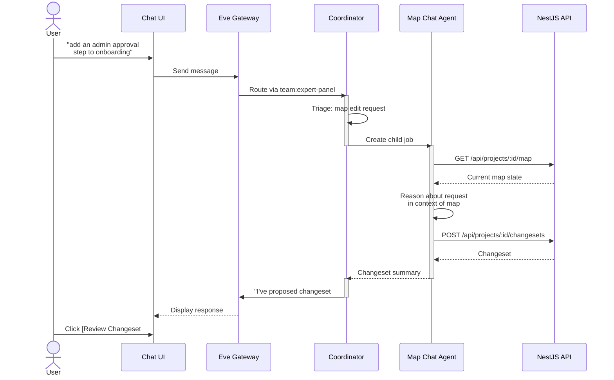

### Map Chat Capabilities

| Request Type | Example | What Happens |
|---|---|---|
| Add structure | "Add a mobile onboarding flow" | Creates activity + steps + empty tasks |
| Add requirements | "Users need password reset via email" | Creates task with story + ACs |
| Modify existing | "Change checkout to support guest users" | Updates task, adds acceptance criteria |
| Ask about map | "What happens after registration?" | Reads map, describes the flow |
| Bulk operations | "Move all admin tasks to a new Admin activity" | Creates changeset with multiple moves |
| Generate from conversation | "Based on what we just discussed, create stories" | Extracts tasks from chat history |

### Map Chat Skill (`skills/map-chat/SKILL.md`)

The Map Chat agent's skill instructs it to:
1. Always read the current map state before proposing changes
2. Match user intent to map operations (create, update, delete, move)
3. Prefer updating existing entities over creating duplicates
4. Raise questions when the request is ambiguous
5. Include reasoning for every proposed change
6. Reference entities by human-readable display_id (e.g. `TSK-1.2.1`, `ACT-3`)
7. Structure changeset items to match the UI change types: `modify_task`,
   `add_task`, `add_question`, `resolve_question`, `modify_user_story`
8. Include `device` badge when creating tasks (default: `all`)

---

## Alignment Detection (Detail)

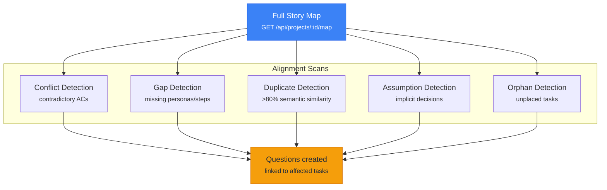

### What It Scans For

| Issue Type | Detection | Example |
|---|---|---|
| **Conflicts** | Tasks with contradictory acceptance criteria or descriptions | Task A: "Guest checkout only" vs Task B: "Require login for all purchases" |
| **Gaps** | Activities with single steps, personas with no tasks in key flows | "Admin" persona has no tasks in "Onboarding" activity |
| **Duplicates** | Tasks with >80% semantic similarity in title + description | "Password reset via email" and "Email-based password recovery" |
| **Assumptions** | Implicit decisions that should be explicit | Task mentions "standard pricing" without defining tiers |
| **Missing personas** | Tasks that reference users not defined as personas | Task says "as a moderator" but no moderator persona exists |
| **Orphan tasks** | Tasks not placed on any step | Created but never placed on the map grid |

### Alignment Output

The alignment agent creates questions (not changesets) for each issue found:

```json
{
  "issues": [
    {
      "type": "conflict",
      "severity": "high",
      "question": "Tasks 'Guest checkout' and 'Require login' contradict. Which is correct?",
      "context": "Found in Purchasing > Checkout step. Both are marked as high priority.",
      "references": ["TSK-3.2.1", "TSK-3.2.4"],
      "category": "product_decision"
    },
    {
      "type": "gap",
      "severity": "high",
      "question": "What compliance requirements span the onboarding and payment flows?",
      "context": "Multiple activities reference KYC but no unified policy is defined.",
      "references": ["ACT-1", "ACT-3", "ACT-5"],
      "category": "compliance",
      "cross_cutting": true
    }
  ]
}
```

Each issue becomes a question in the Q&A system via `question_references`:

- **Task-scoped issues** (conflicts, duplicates) → `display_id: "Q-N"`, references
  point to specific tasks (e.g. `TSK-3.2.1`). These show as amber flag indicators
  on the affected task cards.
- **Cross-cutting issues** (gaps, compliance) → `display_id: "CQ-N"`, references
  point to activities (e.g. `ACT-1`, `ACT-3`). These appear in the red-themed
  cross-cutting questions panel, with clickable reference tags that highlight
  the referenced activities on the map.

All alignment questions have `source = 'alignment'` and inherit `category` from
the issue type (e.g. conflicts → `product_decision`, gaps → `scope`).

---

## Question Evolution (Detail)

When a user answers a question that was raised by an agent, the answer may
change requirements. The question agent checks:

1. Read the answered question + its context
2. Read the affected task(s)
3. Determine if the answer implies a map change
4. If yes: create a changeset proposing the update
5. If no: mark as resolved, no further action

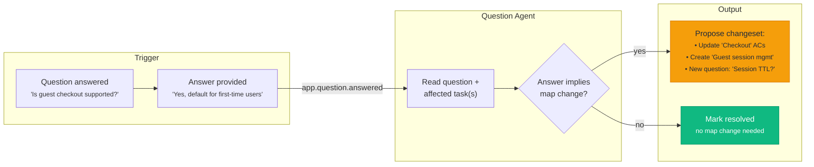

---

## Repo Structure (After)

```
.eve/
  manifest.yaml               # Updated with services + environments
  packs.lock.yaml              # Resolved pack state
  profile.yaml                 # Local profile

eve/
  pack.yaml                    # Pack descriptor
  agents.yaml                  # 14 agents (8 existing + 6 new)
  teams.yaml                   # expert-panel team (unchanged)
  chat.yaml                    # Unchanged (coordinator triages new intents)
  workflows.yaml               # 4 workflows (1 existing + 3 new)
  x-eve.yaml                   # Harness profiles (unchanged)

skills/
  coordinator/SKILL.md         # Updated with new triage categories
  tech-lead/SKILL.md           # Unchanged
  ux-advocate/SKILL.md         # Unchanged
  biz-analyst/SKILL.md         # Unchanged
  gtm-advocate/SKILL.md        # Unchanged
  risk-assessor/SKILL.md       # Unchanged
  qa-strategist/SKILL.md       # Unchanged
  devils-advocate/SKILL.md     # Unchanged
  ingestion/SKILL.md           # NEW: multi-modal file processing
  extraction/SKILL.md          # NEW: structured requirement extraction
  synthesis/SKILL.md           # NEW: map changeset proposals
  alignment/SKILL.md           # NEW: conflict/gap/duplicate detection
  map-chat/SKILL.md            # NEW: conversational map editing
  question/SKILL.md            # NEW: question → map evolution

apps/
  dashboard/                   # React SPA
    src/
      components/
        auth/
          LoginForm.tsx
        layout/
          AppShell.tsx         # Header (gradient dark, sticky) with org/project/stats/toolbar
          Sidebar.tsx          # Map | Sources | Reviews | Q&A | Changes | Releases
          MapToolbar.tsx       # Expand All, Questions Only, Cross-Cutting Qs, Print, Export, Chat, Settings
        map/
          StoryMap.tsx         # CSS Grid: activities × steps × tasks
          ActivityRow.tsx      # Dark header band with persona pills
          StepHeader.tsx       # Accent-colored step header with display_id
          TaskCard.tsx         # Expandable card: badges, title, story, ACs, questions
          TaskCardExpanded.tsx # Expanded: user story block, AC checklist, question pills
          HandoffCard.tsx      # Dashed-border card for persona-to-persona handoffs
          PersonaTabs.tsx      # Sticky tab bar: Overview + per-persona (colored dots, counts)
          RoleFilterPills.tsx  # Header pill buttons for persona highlighting
          MapLegend.tsx        # Sticky legend: persona colors, handoff, question, done icons
          ReleaseSlice.tsx     # Release view overlay
        sources/
          SourceList.tsx       # Ingested documents
          UploadZone.tsx       # Drag-and-drop file upload
        reviews/
          ReviewList.tsx
          ReviewDetail.tsx
          ExpertOpinion.tsx
        questions/
          QuestionList.tsx     # All questions, filterable by status/category/priority
          QuestionCard.tsx     # Question with answer form + "Evolve Map" button
          QuestionModal.tsx    # Centered modal: question, metadata, response, evolve
          CrossCuttingPanel.tsx  # Slide-in panel for cross-cutting questions (red-themed)
        changesets/
          ChangesetList.tsx    # Pending, accepted, rejected
          ChangesetReviewModal.tsx  # 680px centered modal: summary, bulk actions, item cards
          ChangesetItem.tsx    # Per-item card: type icon (blue/green/amber), accept/reject, diff
        releases/
          ReleaseList.tsx
          ReleaseDetail.tsx
        chat/
          ChatPanel.tsx        # Persistent chat at bottom of main area
      pages/
        LoginPage.tsx
        MapPage.tsx            # Default — story map + chat
        SourcesPage.tsx
        ReviewsPage.tsx
        ReviewDetailPage.tsx
        QuestionsPage.tsx
        ChangesetsPage.tsx
        ChangesetDetailPage.tsx
        ReleasesPage.tsx
      hooks/
        useStoryMap.ts         # Fetch + cache map data
        useChangesets.ts       # Changeset operations
        useChatStream.ts       # SSE chat
        useSSE.ts              # Generic SSE hook
      api/
        client.ts              # Typed API client with auth
      App.tsx
      main.tsx
    index.html
    vite.config.ts
    tailwind.config.ts
    Dockerfile

  api/                         # NestJS backend
    src/
      main.ts                  # eveUserAuth() + bridge middleware
      app.module.ts
      common/
        database.service.ts    # RLS-aware DB service
        auth.guard.ts          # NestJS route guard
        eve-events.service.ts  # Call Eve project events API
      projects/
        projects.controller.ts
        projects.service.ts
      personas/
        personas.controller.ts
        personas.service.ts
      activities/
        activities.controller.ts
        activities.service.ts
      steps/
        steps.controller.ts
        steps.service.ts
      tasks/
        tasks.controller.ts
        tasks.service.ts
      step-tasks/
        step-tasks.controller.ts
        step-tasks.service.ts
      questions/
        questions.controller.ts
        questions.service.ts
      releases/
        releases.controller.ts
        releases.service.ts
      sources/
        sources.controller.ts
        sources.service.ts
      reviews/
        reviews.controller.ts
        reviews.service.ts
      changesets/
        changesets.controller.ts
        changesets.service.ts   # Apply changeset logic
      chat/
        chat.controller.ts
        chat.stream.ts         # SSE bridge
      eve/
        eve.service.ts         # Eve API client wrapper
      sync/
        sync.service.ts        # Job result → DB denormalization
    db/
      migrations/
        001_create_projects.sql
        002_create_personas.sql
        003_create_activities.sql
        004_create_steps.sql
        005_create_tasks.sql
        006_create_step_tasks.sql
        007_create_questions.sql
        008_create_question_references.sql
        009_create_releases.sql
        010_create_ingestion_sources.sql
        011_create_reviews.sql
        012_create_expert_opinions.sql
        013_create_changesets.sql
        014_create_changeset_items.sql
        015_create_audit_log.sql
        016_enable_rls.sql
    Dockerfile

docs/
  plans/
    chat-attachment-aware-agents.md   # Implemented
    dashboard-app.md                   # Superseded by this plan
    eden-evolution.md                  # This document
  prd/
    EdenPRD.md                         # Steve's product vision
```

---

## Manifest Changes

```yaml
schema: eve/compose/v2
project: pm-expert-panel

services:
  dashboard:
    build:
      context: ./apps/dashboard
      dockerfile: Dockerfile
    x-eve:
      role: component
      ingress:
        public: true
        port: 3000

  api:
    build:
      context: ./apps/api
      dockerfile: Dockerfile
    x-eve:
      role: worker
      ingress:
        public: true
        port: 4000
      api_spec:
        type: openapi
        spec_url: /openapi.json
      object_store:
        buckets:
          - name: uploads
            visibility: private
            cors:
              origins: ["${service.dashboard.url}"]

  db:
    x-eve:
      role: managed_db
      managed:
        class: db.p1
        engine: postgres
        engine_version: "16"

  migrate:
    build:
      context: ./apps/api
      dockerfile: Dockerfile
    command: ["npx", "typeorm", "migration:run"]
    x-eve:
      role: job
    environment:
      DATABASE_URL: ${managed.db.url}

environments:
  staging:
    pipeline: deploy
    overrides:
      services:
        api:
          environment:
            NODE_ENV: staging
            DATABASE_URL: ${managed.db.url}

x-eve:
  packs:
    - source: ./
```

For Eden v1, the primary document-upload path should still use Eve ingest
records and `system.doc.ingest`. The app bucket above is optional for future
derived assets or exports, not a requirement for the ingestion workflow.
`EVE_API_URL`, `EVE_PUBLIC_API_URL`, `EVE_SSO_URL`, `EVE_ORG_ID`, and
`STORAGE_*` bucket variables are platform-injected for deployed services and
should not be hand-wired in the manifest unless Eden has a specific override
need.

---

## Implementation Order

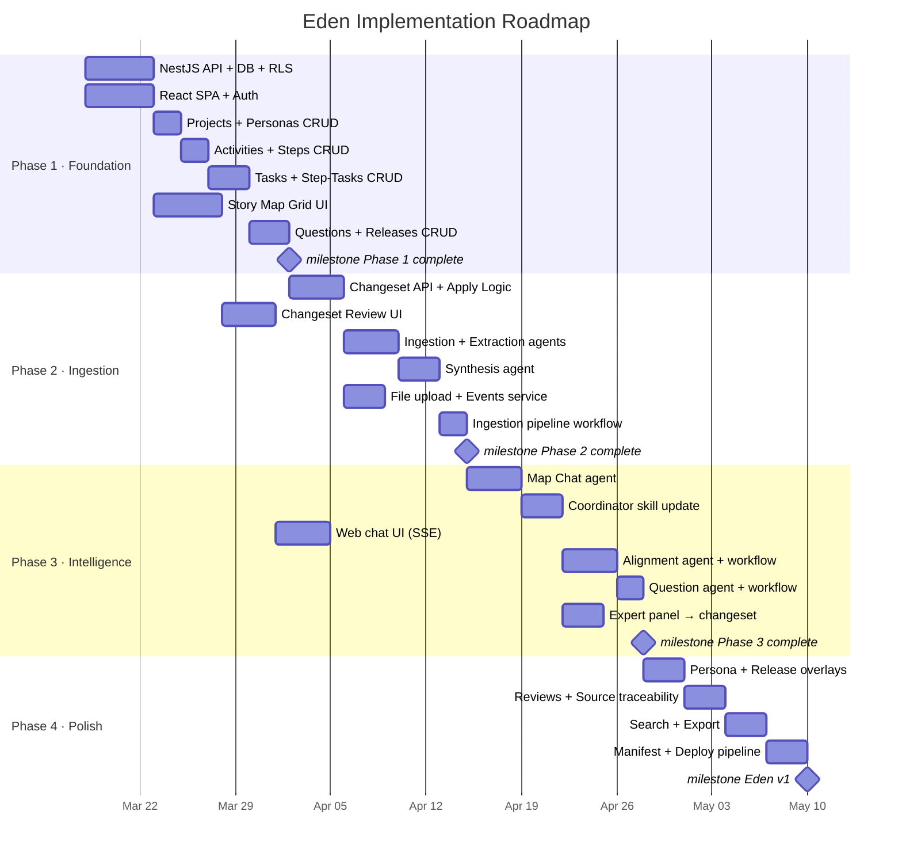

### Phase 1: Foundation (Map + CRUD)

| Step | What | Effort |
|------|------|--------|
| **1a** | Scaffold NestJS API + managed DB + RLS migrations (15 tables) | Medium |
| **1b** | Scaffold React SPA + Vite + Tailwind + Eve Auth (SSO + org switch) | Medium |
| **1c** | Projects CRUD + personas CRUD + org isolation | Small |
| **1d** | Activities + steps CRUD + reorder | Small |
| **1e** | Tasks CRUD + step_tasks placement + reorder | Medium |
| **1f** | Story map grid UI (CSS Grid: activities → steps → tasks) | Medium |
| **1g** | Questions CRUD + question indicators on task cards | Small |
| **1h** | Releases CRUD + task assignment to releases | Small |

**Milestone**: Working story map with manual CRUD. No AI yet.

### Phase 2: Ingestion + Changesets

| Step | What | Effort |
|------|------|--------|
| **2a** | Changeset data model + CRUD API + apply logic | Medium |
| **2b** | Changeset review UI (list, detail, accept/reject/partial) | Medium |
| **2c** | Ingestion agent skill (`skills/ingestion/SKILL.md`) | Small |
| **2d** | Extraction agent skill (`skills/extraction/SKILL.md`) | Medium |
| **2e** | Synthesis agent skill (`skills/synthesis/SKILL.md`) | Medium |
| **2f** | Ingestion pipeline workflow (`eve/workflows.yaml`) | Small |
| **2g** | Source upload session + Eve ingest confirm (`system.doc.ingest`) | Medium |
| **2h** | Sources list UI + upload zone | Small |
| **2i** | Eve events service (emit `app.*` events from NestJS) | Small |

**Milestone**: Upload a file → AI extracts requirements → changeset proposed → user reviews → map updates.

### Phase 3: Intelligence

| Step | What | Effort |
|------|------|--------|
| **3a** | Map Chat agent skill (`skills/map-chat/SKILL.md`) | Medium |
| **3b** | Coordinator skill update (new triage categories + changeset creation) | Medium |
| **3c** | Web chat UI (SSE bridge, chat panel) | Medium |
| **3d** | Alignment agent skill (`skills/alignment/SKILL.md`) | Medium |
| **3e** | Alignment-check workflow + `app.changeset.accepted` event | Small |
| **3f** | Question agent skill (`skills/question/SKILL.md`) | Small |
| **3g** | Question-evolution workflow + `app.question.answered` event | Small |
| **3h** | Expert panel → changeset flow (coordinator creates changeset post-synthesis) | Medium |

**Milestone**: Full AI loop — chat edits, alignment detection, question evolution, expert review → changeset.

### Phase 4: Polish

| Step | What | Effort |
|------|------|--------|
| **4a** | Persona overlay/filter on map UI | Small |
| **4b** | Release slice view on map | Small |
| **4c** | Source traceability (task → source document links) | Small |
| **4d** | Reviews list + detail (job result denormalization) | Medium |
| **4e** | Review progress streaming (SSE) | Small |
| **4f** | Audit trail UI | Small |
| **4g** | Search (full-text across tasks, questions, sources) | Medium |
| **4h** | Export (JSON + Markdown) | Small |
| **4i** | Manifest + deploy pipeline + staging environment | Medium |

**Milestone**: Production-ready Eden with full feature set.

---

## Key Decisions

### Why a journey-persona grid (not Kanban tracks)?

The `dashboard-app.md` plan used tracks (horizontal lanes) with stories as
cards — essentially a simplified Kanban. Eden uses a journey-persona grid:
activities (journey rows) × steps (columns) × tasks (cards). This is more
expressive:

- Activities represent user journeys ("Fund Wallet", "Withdraw Cash")
- Steps represent moments within journeys ("Deposit at Store", "Deposit at ATM")
- Tasks are atomic requirements placed at specific journey points
- Persona tabs switch the entire map view — each persona sees their own slice
- Role filter pills highlight a persona's tasks within any view

This is not Jeff Patton's user story mapping model. Patton organises by a
single horizontal backbone (activities left-to-right) with priority as the
vertical axis and horizontal release slices. Eden's grid is persona-centric
with activities as rows — better suited for persona coverage analysis
("does every user type have their flows covered?") and AI-driven gap
detection ("no tasks in the Bank Transfer step for the admin persona").

### Why changesets instead of direct writes?

Eden's PRD is explicit: "AI never writes directly to the map." This isn't
just a safety feature — it's a trust mechanism. When an AI proposes 12 new
tasks from an uploaded roadmap, the PM needs to review each one before it
becomes part of the canonical requirements set.

Changesets also create an audit trail: who proposed what, why, when it was
accepted/rejected, and by whom. This matters in regulated industries where
requirements traceability is mandated.

### Why 6 new agents (not just the coordinator)?

The coordinator is already doing a lot — triage, file processing, expert
dispatch, synthesis. Adding ingestion, extraction, synthesis, alignment,
map chat, and question processing to the coordinator would make its skill
file unmanageably large and its reasoning brittle.

Separate agents have clear responsibilities, can run in parallel (via
workflows), and can be independently improved. The coordinator orchestrates
but doesn't do everything.

### Why workflow job graphs (not coordinator orchestration)?

The ingestion pipeline (upload → ingest → extract → synthesize) could be
orchestrated by the coordinator creating child jobs. But declarative
workflow graphs are better because:

1. **Decoupled**: The NestJS backend emits an event; it doesn't need to know
   which agents will process it. For file upload, Eve's ingest API emits the
   triggering `system.doc.ingest` event for us.
2. **Reliable**: Eve's event spine handles retries, deduplication, ordering
3. **Observable**: The workflow compiles into a job DAG visible in Eve's
   job tree views — each step is an inspectable job with status, logs, and
   structured outputs
4. **Extensible**: Adding a new post-acceptance check is just a new workflow
5. **API parity**: `with_apis` at the workflow level means each step agent
   gets Eden API access through the same shared path as CLI-created jobs —
   no prompt-level duplication of API instructions

The coordinator still handles *chat-initiated* operations (map chat, expert
panel) because those require conversational context.

### Why questions as first-class (again)?

Carried forward from the dashboard plan because Eden's PRD doubles down on
this. Questions aren't comments — they're tracked entities with lifecycle
(open → answered → resolved), sources (which agent/user raised them), and
downstream effects (answered questions can trigger map changes via the
question agent).

### Why keep the expert panel?

The 7-expert review capability is unique and valuable. It's not duplicated
by Eden's new agents. The expert panel reviews *strategy and feasibility*.
Eden's new agents manage *requirements structure*. Different jobs:

- Expert panel: "Is this technically feasible? What are the UX risks? What's the competitive impact?"
- Eden agents: "Extract 15 user stories from this PDF. Place them on the map. Check for conflicts."

Both create changesets. Both feed the same map. The user sees a unified
history of AI-proposed changes regardless of source.

---

## What Changes vs What's New

```mermaid
graph LR
    subgraph Before["Today · PM Expert Panel"]
        direction TB
        B1["8 Agents<br/><small>coordinator + 7 experts</small>"]
        B2["1 Team<br/><small>staged council</small>"]
        B3["Slack Chat<br/><small>review & respond</small>"]
        B4["1 Workflow<br/><small>doc.ingest</small>"]
        B5["No app code<br/><small>config only</small>"]
    end

    subgraph After["Eden · Requirements Platform"]
        direction TB
        A1["14 Agents<br/><small>+ ingestion, extraction,<br/>synthesis, alignment,<br/>map-chat, question</small>"]
        A2["1 Team + 3 Workflow Graphs<br/><small>+ event-driven job DAGs</small>"]
        A3["Slack + Web Chat<br/><small>+ map editing via chat</small>"]
        A4["React SPA<br/><small>Journey-persona grid</small>"]
        A5["NestJS Backend<br/><small>15 tables · changesets · RLS</small>"]
        A6["Managed Postgres<br/><small>+ object store</small>"]
    end

    Before ==>|"evolves into"| After

    style Before fill:#1e293b,stroke:#475569,color:#e2e8f0
    style After fill:#1e293b,stroke:#8b5cf6,color:#e2e8f0
```

### Stays the Same

- 8 existing agents (coordinator + 7 experts) — skills unchanged
- Staged council dispatch for document reviews
- Slack chat routing through coordinator
- Expert panel review process
- `pm-review` workflow (doc.ingest trigger)

### Evolves

- **Coordinator skill**: New triage categories (map edits → map-chat, alignment checks → alignment agent). Post-synthesis step: create changeset from expert feedback
- **Manifest**: Add services (dashboard, api, db), environments, pipelines
- **Workflows**: Add 3 new event-driven workflow graphs (multi-step with `depends_on` + `with_apis`)

### New

- **6 agents**: ingestion, extraction, synthesis, alignment, map-chat, question
- **React SPA**: Journey-persona story map, changeset review, chat, sources, Q&A, releases
- **NestJS backend**: 15-table domain model, changeset system, event emission, auth
- **Managed DB**: Postgres 16 with RLS for 15 tables
- **Eve ingest + storage**: Presigned upload + `ingest://` resource hydration
- **Event automation**: system.doc.ingest, app.changeset.accepted, app.question.answered
- **Platform primitives**: org-aware auth (`switchOrg`), workflow job DAGs (`depends_on`), server-side `with_apis`

---

## Verification

### Manual CRUD Flow (Phase 1)

1. Log in via Eve SSO
2. Create project "Launch v2" with personas: buyer, admin, support
3. Create activities: "Onboarding", "Purchasing", "Support"
4. Add steps under each activity
5. Create tasks, place on steps with persona assignments
6. View the CSS Grid story map — activities as rows, steps as columns, tasks as cards
7. Filter by persona "buyer" — only buyer-relevant tasks highlighted
8. Add a question to a task — flag appears on the card
9. Switch org — different projects visible, no cross-org data

### Ingestion Flow (Phase 2)

1. Upload `roadmap.pdf` via the Sources page
2. `system.doc.ingest` triggers ingestion-pipeline workflow → 3-step job DAG
3. Job tree shows: root workflow job → ingest → extract → synthesize
4. Status shows "processing" → "extracted" → "synthesized" as steps complete
5. A changeset appears in Changes sidebar (status: pending)
6. Review changeset: 8 proposed tasks across 3 activities
7. Accept 6, reject 2 → accepted tasks appear on the map
8. Source traceability: each task links back to `roadmap.pdf`

### Map Chat Flow (Phase 3)

1. Type in chat: "add a mobile onboarding flow with app download and push notification setup"
2. Coordinator detects map edit → invokes map-chat agent
3. Chat response: "Proposed changeset #15 with 1 activity, 2 steps, 3 tasks"
4. Review changeset → accept → map updates

### Alignment Flow (Phase 3)

1. Accept a changeset that introduces a conflicting requirement
2. `app.changeset.accepted` event triggers alignment-check workflow
3. Alignment agent detects the conflict
4. Question appears in Q&A: "Tasks X and Y have contradictory requirements"
5. Answer the question: "Task X is correct, update Task Y"
6. `app.question.answered` event triggers question-evolution workflow
7. Question agent proposes changeset to update Task Y
8. Review and accept → map consistent

### Expert Panel + Changeset (Phase 3)

1. In Slack: `@eve pm review this spec` + attach a PDF
2. Expert panel runs (unchanged process)
3. Coordinator synthesizes expert feedback
4. NEW: Coordinator creates changeset with extracted stories/tasks
5. Changeset appears in the dashboard alongside expert review
6. Review and accept → tasks appear on the map with expert provenance

### Cross-Channel Continuity

1. Start a review in Slack: `@eve pm review this` + spec.pdf
2. Open the same project in the dashboard
3. See the review in Reviews, the changeset in Changes
4. Accept the changeset → tasks appear on map
5. Continue conversation in web chat (same thread context)
